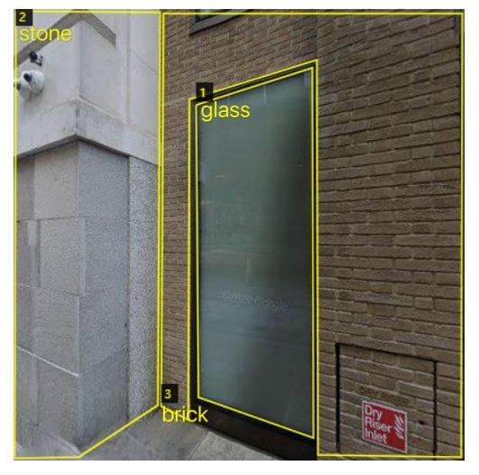
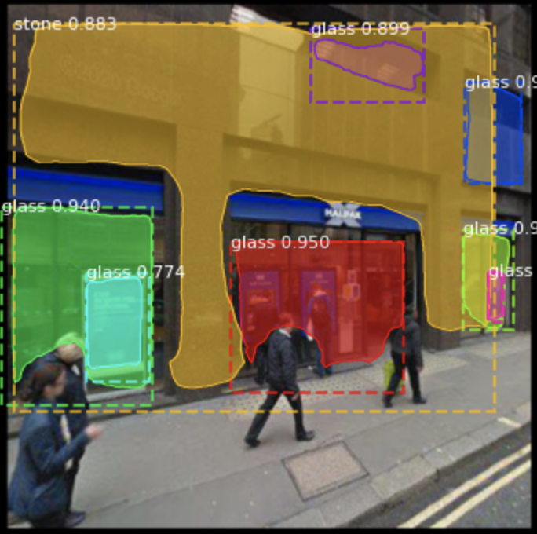

# Housing Material

In this report, we tried to identify and then classify materials of housings’ external wall in the City of London area using a Deep Learning algorithm Mask RCNN and Google Street View images.

## Installation
From the [Releases page](https://github.com/matterport/Mask_RCNN) page download the Mask RCNN repository. Add this repository to the samples file of the Mask RCNN and add the dataset. 

## Dataset
We chose to use VGG Image Annotator (VIA) to annotate housing materials.



## Run Jupyter notebooks
Open the `inspect_housematerial_data.ipynb` or `inspect_housematerial_model.ipynb` Jupter notebooks. You can use these notebooks to explore the dataset and run through the detection pipelie step by step.

## Train the housing material model
Open the `train_housematerial.ipynb` Jupyter notebooks. Or
Train a new model starting from pre-trained COCO weights
```
python3 housematerial.py train --dataset=/path/to/dataset --weights=coco
```

Resume training a model that you had trained earlier
```
python3 housematerial.py train --dataset=/path/to/dataset --weights=last
```

Train a new model starting from ImageNet weights
```
python3 housematerial.py train --dataset=/path/to/dataset --weights=imagenet
```


## Transfer files on Google Cloud Platform
```
gcloud compute scp --recurse housingmaterial@cuda-11-0-20210412-205353:~/path/to/logs ./
```
```
gcloud compute scp --recurse housingmaterial@cuda-11-0-20210412-205353:~/Mask_RDNN/logs ./
```
```
gcloud compute scp --recurse housingmaterial@cuda-11-0-20210412-205353:/home/jupyter/Mask_RCNN/logs/ ./
```

## Visualize training process 
```
tensorboard --logdir=/home/jupyter/Mask_RCNN/logs/ --port=8080
```
```
tensorboard --logdir=logs --port=8080
```

## Detect Example

